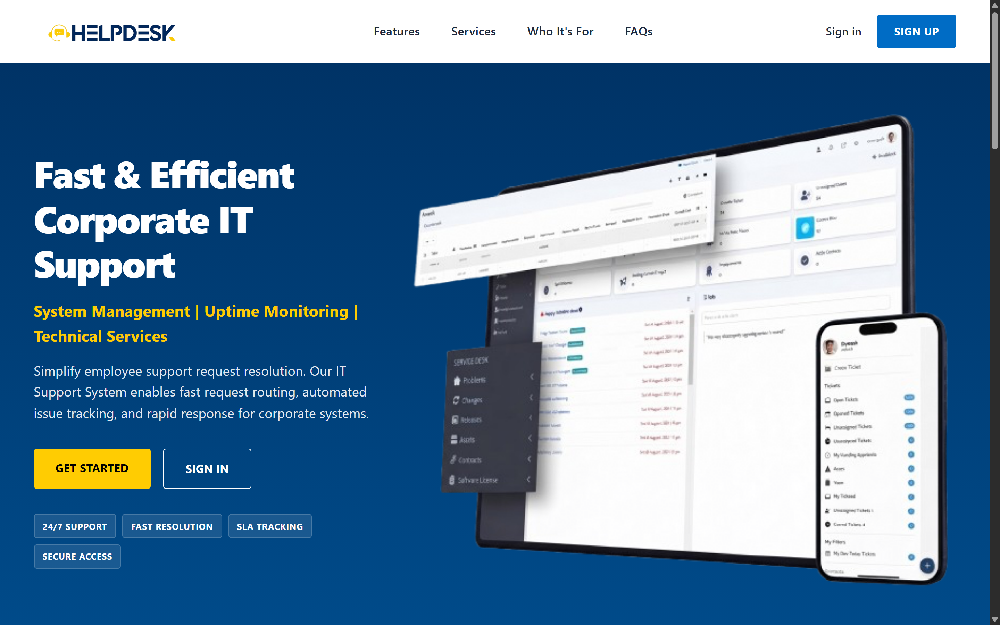

# HelpDesk

## Description

HelpDesk is a full-stack MERN application that lets employees submit IT support tickets and lets IT staff manage and resolve them through a centralized dashboard. Employees create tickets with a title, category, priority, and description, and track their status. IT staff view all submitted tickets and update their status through Open, In Progress, and Resolved stages.

We built this because IT support requests at many workplaces get lost in email or chat, this gives both sides a clear, trackable system.

**What you can do in the app:**

- Sign up as an employee or as IT staff, sign in, and sign out (JWT authentication).
- Employees: create, edit, and delete their own tickets, and follow them from the dashboard or the My Tickets page with search, priority, and status filters.
- IT staff: see every ticket on the IT dashboard, filter by status, and move a ticket through Open, In Progress, and Resolved.
- IT staff: create, rename, and delete the ticket categories that employees choose from.
- Everyone signed in: comment on a ticket, and edit or delete their own comments.
- Guests are redirected to sign in and cannot reach any ticket, category, or comment screen.

## Getting Started

- **[Deployed app](https://REPLACE-WITH-YOUR-VERCEL-URL.vercel.app)** <!-- TODO: paste the real Vercel URL here -->
- [Planning Materials (Trello)](https://trello.com/b/fqiYl2Yv/helpdesk-project-board)
- [Back-end Repository](https://github.com/hassanelmaayati/helpdesk-backend.git)

## Attributions

- Icons: [Lucide](https://lucide.dev/) — used through the `lucide-react` library.

## Technologies Used

**Front-end**

- React
- React Router
- Vite
- Axios
- lucide-react
- CSS (Flexbox and Grid)

**Back-end**

- Node.js
- Express
- MongoDB with Mongoose
- JSON Web Tokens (JWT)
- bcrypt

**Services**

- MongoDB Atlas for the database
- Vercel for the front-end deployment

## Next Steps

- Assign a ticket to a specific IT staff member instead of a shared queue.
- Email notifications when a ticket changes status or receives a comment.
- File attachments on tickets, so screenshots of an error can be sent with the request.
- Search, sorting, and pagination on the All Tickets page for larger ticket volumes.
- Sign the user out automatically when their token expires, rather than showing errors until they sign out by hand.
- A reporting view for IT staff with resolution times and ticket volume over time.
